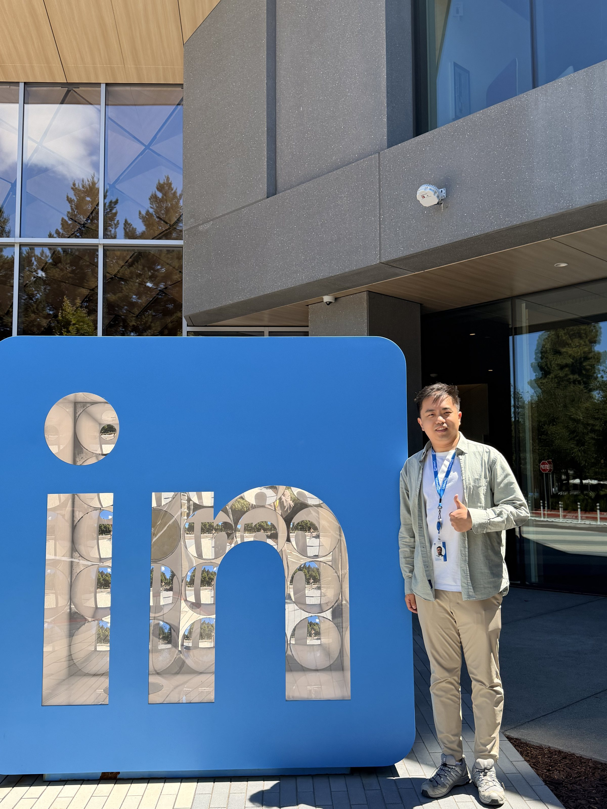

This summer I joined **LinkedIn** in Mountain View, CA as an AI/ML Engineer intern on the
**Generative AI** team, working on candidate retrieval for LinkedIn's hiring assistant.

## What I worked on

- **Generative retrieval for hiring.** I developed generative AI models for candidate retrieval,
  improving hiring recall by **46.4%** and role fit by **33.3%** in offline evaluation through
  reinforcement learning.
- **The team's first RL pipeline.** I built the group's first reinforcement-learning pipeline for
  candidate retrieval, using LLM-based rewards. To keep training fast, I created a candidate-profile
  lookup table that replaced per-step online requests and cut training latency.
- **Constrained decoding.** I implemented constrained decoding to prioritize candidates who are
  actively seeking jobs, increasing their share among retrieved candidates.
- **Codebook evaluation.** Alongside the retrieval work, I built an end-to-end pipeline for assessing
  training codebook quality for generative recruiting models — data checks, drift detection, and
  robustness analyses across cohorts and over time — and proposed a task-specific metric aligned to
  downstream hiring objectives such as match relevance and conversion propensity.

## What I took away

Coming from a research background in LLM safety and unlearning, the biggest shift was how much of
production ML is about *evaluation infrastructure* rather than modeling. A reward model is only as
trustworthy as the offline evaluation you check it against, and most of the leverage came from making
that evaluation faster and more honest.

Thanks to my mentor and the whole team for a great summer.
