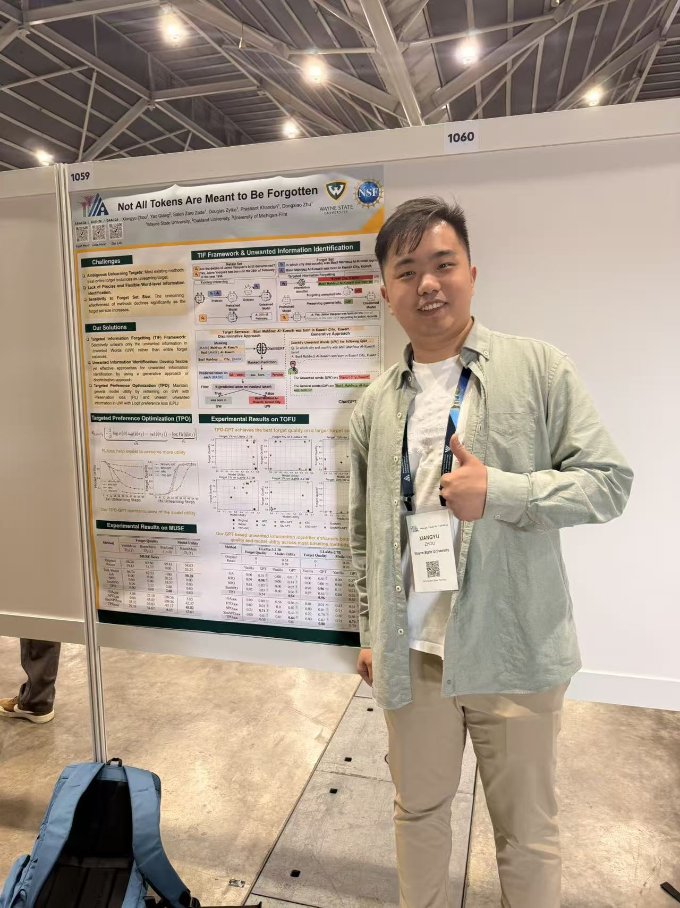

Our paper **"Not All Tokens Are Meant to Be Forgotten"** was accepted as an **oral** at AAAI-26 in
Singapore. The work is joint with Yao Qiang, Saleh Zare Zade, Douglas Zytko, Prashant Khanduri, and my
advisor Dongxiao Zhu, across Wayne State University, Oakland University, and the University of
Michigan-Flint.

